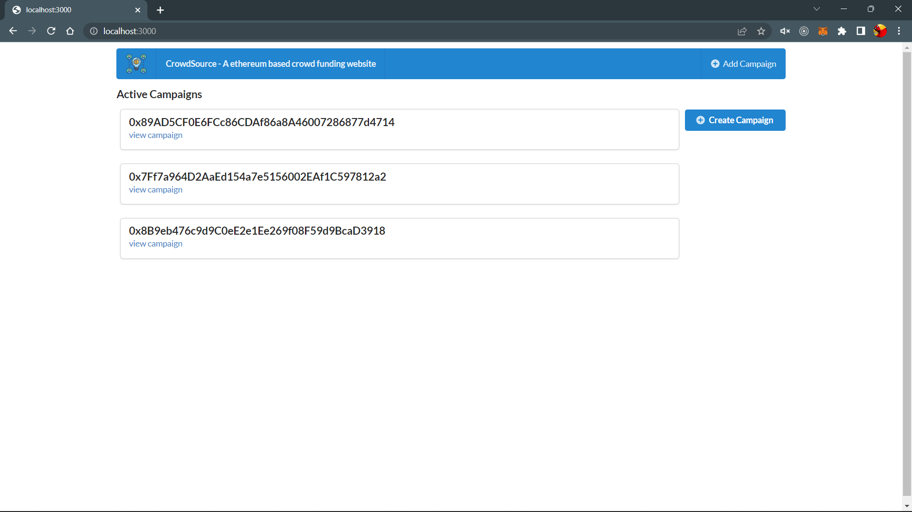
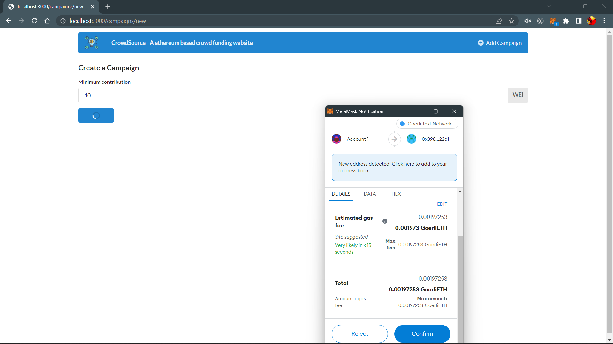
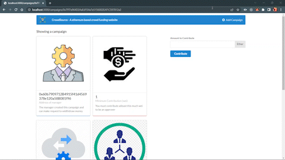
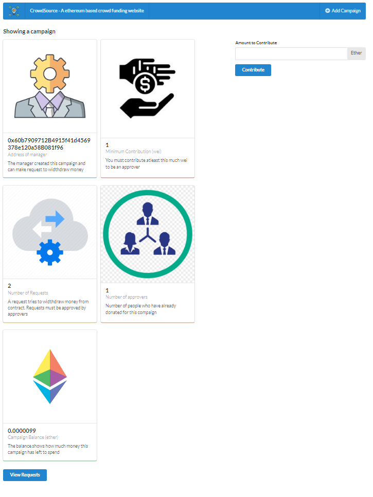
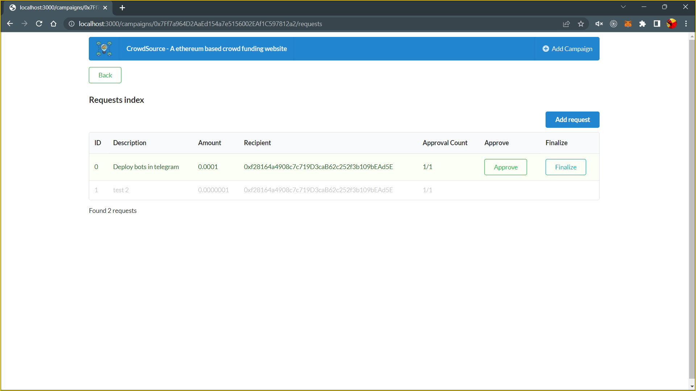
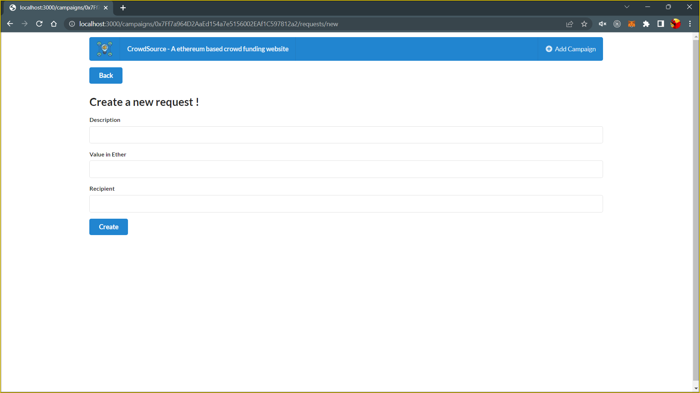

# CrowdFunding-ethereum

# Commands

### Compile

Compile the Solidity Contract and generate ABI and contract's bytecode.

```bash
$ node ethereum/compile.js
```

### Deploy Contract

Deploy the Solidity Contract and obtain the contract's address.

```bash
$ node ethereum/deploy.js
```

### Test

Tests the Solidity Contract with mocha.

```bash
$ npm run test
```

### Run Development Server

Starts the development server.

```bash
$ npm run dev
```

# Steps

- Compile and deploy the contract on the Ethereum Network;
- Must have values for theses variables:
   - Campaign Factory address obtained from the deploy step.
   - Mnemonic phrase of your wallet.
   - Ethereum Network Infura API URL.
- Run the development server.

# Pages

## Campaigns List


## Create Campaign


## Campaign Details




## Requests List


## New Request

